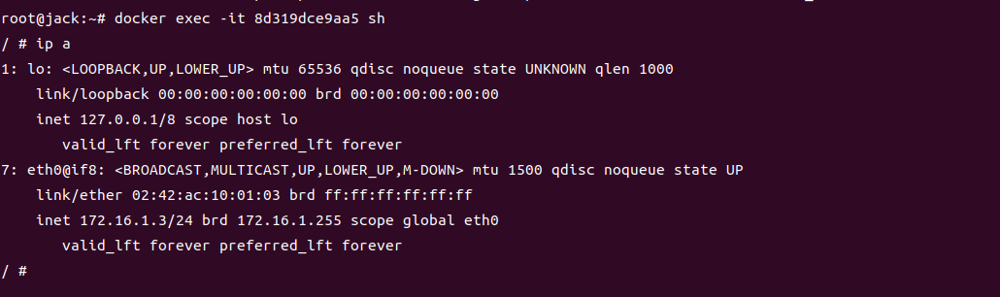

## VXLAN

VXLAN技术(Virtual Extensible Local Area Network)是一种虚拟化隧道通信技术。它通过将已有的三层物理网络作为Underlay网络，在其上构建出虚拟的二层网络，即Overlay网络（大二层网络，就像所有容器都连在一个交换机下）。Overlay网络通过Mac-in-UDP封装技术、利用Underlay网络提供的三层转发路径，实现租户二层报文跨越三层网络在不同的站点间传递。对于租户来说，Underlay网络是透明的，同一租户的不同站点就像是工作在一个局域网中。
***VXLAN的最大优点就是对网络改动少，只要底层网络能够通信，就能在上面搭建VXLAN网络。对于原先网络结构改动小，只需配置边缘VTEP，非常灵活和便于维护。***

**VXLAN的几个重要概念如下：**
* VTEP（VXLAN Tunnel Endpoints）：
  VXLAN网络的边缘设备，我们知道隧道技术一般都是点对点的，对于VXLAN网络，VTEP就是那个点用来进行VXLAN报文的处理（封包和解包）。VTEP可以是网络设备（例如交换机），也可以是一台机器（例如虚拟化集群中的宿主机）；
* VNI（VXLAN Network Identifier）：
  VNI是每个VXLAN的标识，有24bit，因此最大值是2^24=16777216。如果一个VNI对应一个租户，那么理论上VXLAN可以支撑千万级别的租户。

* VXLAN的报文格式
  
  

  可以看到VXLAN报文的Payload就是以太网帧。


### VXLAN作为容器跨节点通信解决方案之一

在kubernetes生态下，容器运行时只负责解决本节点上容器的通信问题，例如docker，通过虚拟网桥和veth pair技术进行实现的；而对于不同节点上的容器如何进行通信kubernetes则是通过CNI插件实现的，很多CNI插件都是支持VXLAN模式跨节点容器通信的方式。下面介绍一下通过VXLAN怎么实现跨节点容器通信，首先网络拓扑图如下:


1. 创建Vxlan虚拟网卡
  
  ```sh
    ip link add vxlan0 type vxlan \
    id 1 \
    dstport 4789 \
    remote 192.168.56.3 \
    local 192.168.56.2 \
    dev enp0s3
  ```

其中id就是VNI；UDP目的端口号固定为4789，IANA（国际互联网组织）分配的端口是 4789；remote表示远端的VTEP地址，local表示自身地址

2. 将vxlan0加入docker0
  
  ```sh
    brctl addif docker0 vxlan0
    ip link set vxlan0 up
  ```

同样对Host2进行如上操作，就可以发现容器可以跨节点通信了，如图所示:


通过上面的配置,在Host1上指定对端VETP为Host2,Host2上指定对端VETP为Host1,Host1的VXLAN报文全部转发到Host2,Host2的VXLAN报文全部转发到Host1从而实现Oerlay通信。

虽然Host1和Host2实现了通信，但这只有两个节点，而kubernetes集群通常是三个及以上的组网。通过上面的方式显然是不能够实现，如何实现多个节点的VXLAN组网呢？

通过上面的跨节点通信，我们大致可以判断主要有下面两个条件：

* 知道所在VXLAN网络的VNI
* 知道通信对象在那个VETP节点上

VNI用来标识一个VXLAN网络，这是提前约定好的。
最主要是如何发现通信对象在那个VETP节点上，上面通过初始化vxlan设备时指定remote vtep来进行转发，但缺点就是只能转发到指定的remote vetp上。所以如何解决多节点VXLAN网络通信就是解决如何发现通信对象所在VETP的问题。

#### 组播

1. 创建Vxlan虚拟网卡

  ```sh
    ip link add vxlan0 type vxlan \
    id 1 \
    dstport 4789 \
    group 239.1.1.1 \
    local 192.168.56.2 \
    dev enp0s3
  ```

这里使用group表示组播地址

2. 将vxlan0加入docker0
  
  ```sh
    brctl addif docker0 vxlan0
    ip link set vxlan0 up
  ```

通信抓包如下：


可以看到Host1将VXLAN报文发往239.1.1.1这一组播地址上，Host2也是这个组播地址收到包后对其进行回复。多播实现很简单，不需要中心化的控制，但是不是所有的网络都支持多播。

#### 手动维护VETP组

如果有一种方法能够不通过多播，能把 overlay 的广播报文发送给所有的 vtep 主机的话，也能达到相同的功能。当然在维护 vtep 网络组之前，必须提前知道哪些 vtep 要组成一个网络，以及这些 vtep 在哪些主机上。Linux 的 vxlan 模块也提供了这个功能，而且实现起来并不复杂。创建 vtep interface 的时候不使用 remote 或者 group 参数就行。

1. 创建Vxlan虚拟网卡

  ```sh
    ip link add vxlan0 type vxlan \
    id 1 \
    dstport 4789 \
    dev enp0s3
  ```

1. 将vxlan0加入docker0
  
  ```sh
    brctl addif docker0 vxlan0
    ip link set vxlan0 up
  ```

3. 手动添加默认的FDB表项

1,2步配置好后，vxlan0收到报文后并不知道向那里进行转发，这时我们可以手动添加默认的FDB表项，比如在Host1上配置到Host2的默认FDB表项：
  
  ```sh
    bridge fdb append 00:00:00:00:00:00 dev vxlan0 dst 192.168.56.3
  ```

这里的00:00:00:00:00:00表示默认表项，如果没有匹配的VETP表项就会将VXLAN报文发向192.168.56.3，当然这里可以有多条默认表项，当没有匹配的VETP表项就会向所有的默认表项发去。

这是添加默认表现后的Host1


这是Host1上容器172.16.1.2 ping Host2上容器172.16.1.3后vxlan0学习到的FDB表项，可以发现学习到的目标mac地址与Host2上容器内部的mac地址一样。


